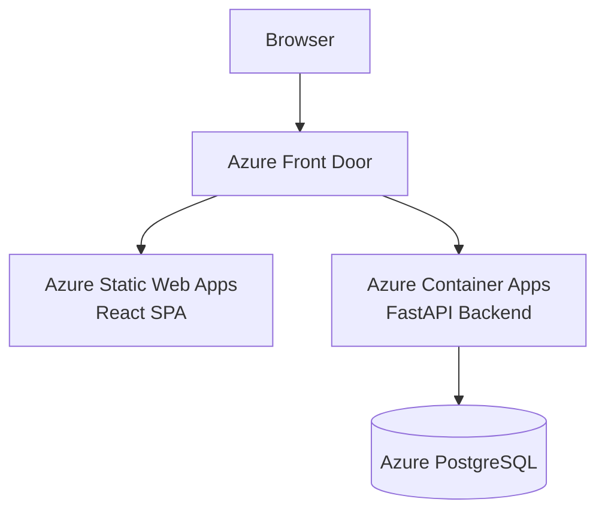

# React Meal Planner — Architecture

## 1. High-level architecture

- **Goal**: A React + TypeScript SPA that lets users manage a weekly meal plan (7 meals), trigger AI recipe generation, refine recipes via chat, generate a grocery list, and view per-recipe nutrition data.
- **Backend**: FastAPI + PostgreSQL at `VITE_API_BASE_URL` (default: `http://localhost:8000`).
- **Deployment**: Azure Static Web Apps, served behind Azure Front Door, which proxies the backend under the same origin — enabling `SameSite=Strict` cookies for the JWT auth flow.



## 2. Directory structure

```
src/
  components/        # Shared, reusable UI components (PascalCase, named exports)
  pages/             # Route-level components (one per route, default export ok)
  hooks/             # Custom hooks (useXxx.ts) — all useQuery/useMutation calls live here
  context/
    AuthContext.tsx  # Auth state + login/logout
  lib/
    api/
      client.ts      # Single Axios instance with interceptors
      auth.ts        # login, register, logout, refresh
      mealPlans.ts   # CRUD + generate-recipes
      recipes.ts     # CRUD + nutrition
      chat.ts        # sessions + messages
      grocery.ts     # list + items + export
    queryKeys.ts     # All React Query key factories
  types/             # TypeScript types mirroring backend Pydantic schemas
    auth.ts
    mealPlan.ts
    recipe.ts
    chat.ts
    grocery.ts
    nutrition.ts
    user.ts
  router.tsx         # React Router route definitions
  main.tsx           # App entrypoint — QueryClientProvider, RouterProvider
```

## 3. Routing structure

All authenticated routes are wrapped in `<RequireAuth>`, which blocks rendering (shows a spinner) while `isLoading` is `true`, then redirects to `/login` if the user is not authenticated. Auth state is derived from a `/users/me` query result — the frontend never reads the cookie.

```
/login                  LoginPage
/register               RegisterPage
/auth/google/callback   GoogleCallbackPage   — handles OIDC redirect, then navigates to /
/ (RequireAuth)
  /                     MealPlansPage        — list of weekly plans
  /meal-plans/:id       MealPlanDetailPage   — plan + meals + generate-recipes trigger
  /recipes              RecipesPage          — recipe library with search
  /recipes/:id          RecipeDetailPage     — recipe + ingredients + chat + nutrition
  /grocery/:listId      GroceryListPage      — checklist view
  /profile              ProfilePage          — user settings, unit preference
```

## 4. API integration layer

All API calls go through one Axios instance (`src/lib/api/client.ts`). The JWT is an `HttpOnly` cookie — the frontend never reads the token. The browser attaches it automatically on same-origin requests.

The **response interceptor** handles:

1. **401 (access token expired)**: silently calls `POST /auth/refresh`. Concurrent 401s are serialised — only one refresh fires; all other failed requests queue and replay once refresh succeeds. If refresh itself fails (refresh token expired or revoked), the queue flushes with errors and the user is sent to `/login`.
2. **Other errors**: propagated as rejected Promises so hooks can display them.

```ts
// src/lib/api/client.ts (outline)
import axios from 'axios';

export const apiClient = axios.create({
  baseURL: import.meta.env.VITE_API_BASE_URL,
});

// response interceptor — token refresh on 401
apiClient.interceptors.response.use(
  (res) => res,
  async (error) => {
    // serialise concurrent 401s, call POST /auth/refresh, replay
    // redirect to /login on refresh failure
  },
);
```

API functions are grouped by resource, each returning typed results:

```ts
// src/lib/api/recipes.ts
import { apiClient } from './client';
import type { RecipeRead, RecipeCreate } from '../../types/recipe';

export async function fetchRecipes(): Promise<RecipeRead[]> {
  const { data } = await apiClient.get<RecipeRead[]>('/recipes');
  return data;
}

export async function createRecipe(body: RecipeCreate): Promise<RecipeRead> {
  const { data } = await apiClient.post<RecipeRead>('/recipes', body);
  return data;
}
```

## 5. Server state — React Query v5

React Query owns all server state. The pattern is:

```
Page / Component  →  custom hook (src/hooks/)  →  API function (src/lib/api/)  →  Axios client
```

- Custom hooks live in `src/hooks/` — never call `useQuery` / `useMutation` directly in components.
- Query keys are factored in `src/lib/queryKeys.ts` to guarantee correct cache invalidation on mutations.
- Do not lift server state into `useState` or a global store.

```ts
// src/lib/queryKeys.ts
export const recipeKeys = {
  all: ['recipes'] as const,
  lists: () => [...recipeKeys.all, 'list'] as const,
  detail: (id: number) => [...recipeKeys.all, 'detail', id] as const,
};

export const mealPlanKeys = {
  all: ['mealPlans'] as const,
  lists: () => [...mealPlanKeys.all, 'list'] as const,
  detail: (id: number) => [...mealPlanKeys.all, 'detail', id] as const,
};
```

## 6. Auth state

`AuthContext` (`src/context/AuthContext.tsx`) exposes:

| Field | Type | Description |
|---|---|---|
| `isAuthenticated` | `boolean` | `true` when `/users/me` resolves successfully |
| `isLoading` | `boolean` | `true` while `/users/me` is in flight |
| `user` | `UserRead \| null` | Current user data |
| `login` | `(email, password) => Promise<void>` | Calls `POST /auth/login`, then refetches `/users/me` |
| `logout` | `() => Promise<void>` | Calls `POST /auth/logout`, redirects to `/login` |

`<RequireAuth>` renders a full-page spinner while `isLoading` is `true`. Without this, a hard refresh on a protected route either briefly flashes protected content or incorrectly redirects an authenticated user to `/login`.

## 7. Type system

All TypeScript types in `src/types/` mirror the backend Pydantic schema naming:

| Suffix | Purpose | Example |
|---|---|---|
| `*Read` | API response shapes — include `id`, timestamps, nested reads | `RecipeRead` |
| `*Create` | POST request body shapes | `RecipeCreate` |
| `*Update` | PATCH/PUT request body shapes (partial fields) | `RecipeUpdate` |

Zod schemas in forms are derived from `*Create` / `*Update` types (not independently defined). Keep the Zod schema and the TypeScript type in sync — infer the TS type from the Zod schema via `z.infer<>`.

```ts
// src/types/recipe.ts
export type RecipeIngredientRead = {
  id: number;
  name: string;
  quantity: number;
  unit: string;
  category: string;
};

export type RecipeRead = {
  id: number;
  title: string;
  servings: number;
  instructions: string;
  source_model: string | null;
  ingredients: RecipeIngredientRead[];
  created_at: string;
};

export type RecipeCreate = {
  title: string;
  servings: number;
  instructions: string;
  ingredients: Omit<RecipeIngredientRead, 'id'>[];
};
```

## 8. Unit system

The backend always returns metric units (`g`, `ml`, `litre`, etc.). `UserPreferences.unit_system` (`metric` | `imperial`) is a **display hint only** — the API never converts values, and the frontend must not submit imperial values to the API.

- A `formatQuantity(value: number, unit: string, unitSystem: UnitSystem): string` utility handles display conversion.
- Manual recipe creation forms accept the user's preferred unit for UX, but convert to metric before submission.
- Null nutrition macro fields are displayed as `—` (unknown), not `0`.

## 9. Styling

- **Tailwind CSS v4** — layout, spacing, typography, colour, responsive breakpoints (`sm:`, `md:`, `lg:`).
- **MUI v9** — interactive components: `Button`, `TextField`, `Select`, `Dialog`, `Snackbar`, `CircularProgress`, `Chip`, etc.
- Keep the two systems separated: Tailwind on wrappers/layout, MUI `sx` for component-level overrides.
- Do not use the `style` prop or custom CSS files for component-level styles.

## 10. Data flow example

```
MealPlanDetailPage
  └── useMealPlan(id)                     ← src/hooks/useMealPlan.ts
        └── fetchMealPlan(id)             ← src/lib/api/mealPlans.ts
              └── GET /meal-plans/:id     ← FastAPI backend

  └── useGenerateRecipes()                ← src/hooks/useGenerateRecipes.ts
        └── generateRecipes(planId)       ← src/lib/api/mealPlans.ts
              └── POST /meal-plans/:id/generate-recipes
        onSuccess: invalidateQueries(mealPlanKeys.detail(id))
```
