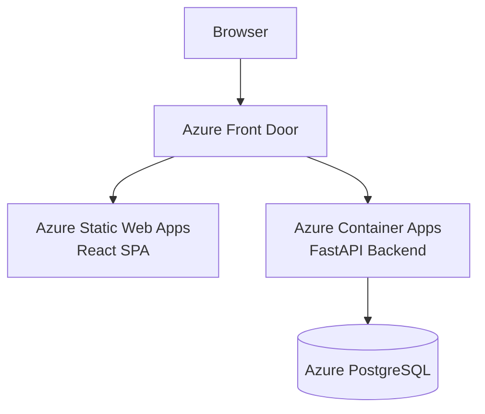

# React Meal Planner — Architecture

## 1. High-level architecture

- **Goal**: A React + TypeScript SPA that lets users manage a weekly meal plan (7 meals), trigger AI recipe generation per-plan or per-course, refine recipes via chat, generate a grocery list, and view per-recipe nutrition data.
- **Backend**: FastAPI + PostgreSQL at `VITE_API_BASE_URL` (default: `http://localhost:8000`).
- **Deployment**: Azure Static Web Apps, served behind Azure Front Door, which proxies the backend under the same origin — enabling `SameSite=Strict` JWT cookies.


```mermaid
flowchart TD
  browser[Browser] --> afd[Azure Front Door]
  afd --> swa[Azure Static Web Apps\nReact SPA]
  afd --> aca[Azure Container Apps\nFastAPI Backend]
  aca --> db[(Azure PostgreSQL)]
```

## 2. Directory structure

```
src/
  components/        # Shared, reusable UI components (PascalCase, named exports)
    layout/          # AppShell (authenticated chrome) vs PageTemplate (auth cards)
  pages/             # Route-level components (one per route, default export ok)
  hooks/             # Custom hooks (useXxx.ts) — all useQuery/useMutation calls live here
  context/
    AuthContext.tsx  # Auth state + login/logout + unitSystem preference
  lib/
    api/
      client.ts      # Single Axios instance with interceptors
      accessToken.ts # Bearer token storage (dev only)
      authMode.ts    # usesBearerTokenAuth() / usesCookieAuth() per environment
      baseUrl.ts     # resolveApiBaseURL()
      auth.ts        # login, register, logout, refresh
      mealPlans.ts   # CRUD + generate-recipes + generate-course-recipe
      recipes.ts     # CRUD + nutrition
      chat.ts        # sessions + messages
      grocery.ts     # list + items + export
      user.ts        # me, preferences
    mealPlanDays.ts  # Day/course label constants + isFilledPlannedMeal + toPlannedMealCreates
    queryKeys.ts     # All React Query key factories
    theme/           # MUI theme + Tailwind token definitions
  types/             # TypeScript types mirroring backend Pydantic schemas
  router.tsx         # React Router route definitions
  main.tsx           # App entrypoint — QueryClientProvider, RouterProvider
```

## 3. Routing structure

All authenticated routes are wrapped in `<RequireAuth>`, which blocks rendering (shows a spinner) while `isLoading` is `true`, then redirects to `/login` if the user is not authenticated. Auth state is derived from a `/users/me` query result — the frontend never reads the cookie.

```
/login                  LoginPage
/register               RegisterPage
/auth/google/callback   GoogleCallbackPage   — handles OIDC redirect, then navigates to /
/ (RequireAuth → AppShell)
  /                     MealPlansPage        — list of weekly plans
  /meal-plans/:id       MealPlanDetailPage   — plan + meals + generate-recipes trigger
  /recipes              RecipesPage          — recipe library with search
  /recipes/:id          RecipeDetailPage     — recipe + ingredients + chat + nutrition
  /grocery              GroceryListPage      — stub index when no list is selected
  /grocery/:listId      GroceryListPage      — checklist view
  /profile              ProfilePage          — user settings, unit preference
```

## 4. Auth transport — environment-split

The client uses different auth mechanisms per build. See [CONV-AUTH](CONVENTIONS.md#conv-auth).

| Environment | Transport | Token storage |
|---|---|---|
| `dev` (`npm run dev`) | `Authorization: Bearer <token>` | In-memory + `sessionStorage` (restored on page load) |
| `prod` (`npm run build`) | `HttpOnly` cookie (browser attaches automatically) | Never accessible to JS |

`authMode.ts` — `usesBearerTokenAuth()` returns `true` when `import.meta.env.PROD` is false. The Axios request interceptor in `client.ts` reads this flag and conditionally adds the `Authorization` header.

`accessToken.ts` — In dev, `setAccessToken()` stores the token in-memory and `sessionStorage`. `restoreAccessToken()` runs on module load to rehydrate from `sessionStorage` so page refreshes don't require re-login. In prod, all accessToken functions are no-ops.

`withCredentials: true` is set on the Axios instance for both environments (needed for dev cross-origin cookie delivery; harmless for prod same-origin requests).

## 5. API integration layer

All API calls go through one Axios instance (`src/lib/api/client.ts`). See [CONV-API-CLIENT](CONVENTIONS.md#conv-api-client).

The **response interceptor** handles:

1. **Auth endpoints** (`/auth/refresh`, `/auth/login`, `/auth/register`): skip retry logic entirely — reject immediately.
2. **401 in Bearer mode with no token**: redirect to `/login` immediately.
3. **401 (access token expired)**: silently calls `POST /auth/refresh`. Concurrent 401s are serialised — only one refresh fires; all other failed requests queue and replay once refresh succeeds. If refresh itself fails, the queue flushes with errors and the user is sent to `/login`.
4. **Other errors**: propagated as rejected Promises so hooks can display them.

## 6. Server state — React Query v5

React Query owns all server state. The pattern is:

```
Page / Component  →  custom hook (src/hooks/)  →  API function (src/lib/api/)  →  Axios client
```

- Custom hooks live in `src/hooks/` — never call `useQuery` / `useMutation` directly in components.
- Query keys are factored in `src/lib/queryKeys.ts` to guarantee correct cache invalidation on mutations. See [CONV-QUERY-KEYS](CONVENTIONS.md#conv-query-keys).

```ts
// src/lib/queryKeys.ts (abridged)
export const userKeys = {
  all: ['users'] as const,
  me: () => [...userKeys.all, 'me'] as const,
  preferences: () => [...userKeys.all, 'preferences'] as const,
};

export const mealPlanKeys = {
  all: ['mealPlans'] as const,
  lists: () => [...mealPlanKeys.all, 'list'] as const,
  detail: (id: number) => [...mealPlanKeys.all, 'detail', id] as const,
  meals: (planId: number) => [...mealPlanKeys.detail(planId), 'meals'] as const,
  meal: (planId: number, mealId: number) => [...mealPlanKeys.meals(planId), mealId] as const,
};

export const recipeKeys = {
  all: ['recipes'] as const,
  lists: () => [...recipeKeys.all, 'list'] as const,
  list: (params: object) => [...recipeKeys.lists(), params] as const,
  detail: (id: number) => [...recipeKeys.all, 'detail', id] as const,
  byMeal: (mealId: number) => [...recipeKeys.all, 'byMeal', mealId] as const,
  nutrition: (recipeId: number) => [...recipeKeys.all, 'nutrition', recipeId] as const,
};
```

## 7. Auth state

`AuthContext` (`src/context/AuthContext.tsx`) derives its state from **two** React Query calls:

- `useMe()` — `GET /users/me` with `retry: false` (so unauthenticated users redirect quickly). `isAuthenticated = meQuery.isSuccess`, `isLoading = meQuery.isPending`.
- `usePreferences({ enabled: meQuery.isSuccess })` — `GET /users/preferences`. Only fires after `/users/me` resolves. Provides `unitSystem` (defaults to `'metric'` until resolved).

`unitSystem` is **not** part of the `/users/me` response.

| Field | Type | Description |
|---|---|---|
| `isAuthenticated` | `boolean` | `true` when `/users/me` resolves successfully |
| `isLoading` | `boolean` | `true` while `/users/me` is in flight |
| `user` | `UserRead \| null` | Current user data |
| `unitSystem` | `UnitSystem` | From `/users/preferences`; defaults to `'metric'` |
| `login` | `(email, password) => Promise<void>` | Calls `POST /auth/login`, then refetches `userKeys.all` |
| `logout` | `() => Promise<void>` | Calls `POST /auth/logout`, calls `queryClient.clear()`, navigates to `/login` |

`<RequireAuth>` renders a full-page spinner while `isLoading` is `true`. Without this, a hard refresh on a protected route either briefly flashes protected content or incorrectly redirects an authenticated user to `/login`.

`logout` calls `queryClient.clear()` — wiping the entire cache — not `invalidateQueries`, to prevent stale user data leaking if another user logs in during the same browser session.

## 8. Type system

All TypeScript types in `src/types/` mirror the backend Pydantic schema naming:

| Suffix | Purpose | Example |
|---|---|---|
| `*Read` | API response shapes — include `id`, timestamps, nested reads | `RecipeRead` |
| `*Create` | POST request body shapes | `RecipeCreate` |
| `*Update` | PATCH/PUT request body shapes (partial fields) | `RecipeUpdate` |

Zod schemas in forms are the source of truth — infer the TypeScript type via `z.infer<typeof schema>`. See [CONV-TYPES](CONVENTIONS.md#conv-types).

## 9. Unit system

The backend always returns metric units. `UserPreferences.unit_system` (`metric` | `imperial`) is a **display hint only** — the API never converts values, and the frontend must not submit imperial values to the API. See [CONV-UNITS](CONVENTIONS.md#conv-units).

- `formatQuantity(value, unit, unitSystem)` handles display conversion.
- Null nutrition macro fields are displayed as `—`, never `0`.

## 10. Styling

- **Tailwind CSS v4** — layout, spacing, typography, colour, responsive breakpoints.
- **MUI v9** — interactive components: `Button`, `TextField`, `Select`, `Dialog`, `Snackbar`, `CircularProgress`, `Chip`, etc.
- **`src/lib/theme/tokens.ts`** — single source of truth for brand colours. Never add hex literals to pages or components. See [CONV-STYLING](CONVENTIONS.md#conv-styling).
- Keep the two systems separated: Tailwind on wrappers/layout, MUI `sx` for component-level overrides.
- Authenticated routes render inside `AppShell` (`src/components/layout/AppShell.tsx`) — header, nav, and footer. Login, register, and similar standalone flows keep using `PageTemplate`.

## 11. Non-obvious mutation behaviors

### `useGenerateRecipes` — two-step API call

Before firing `POST /meal-plans/:id/generate-recipes`, the mutation:
1. Filters planned meals to rows with a `meal_name` set (`isFilledPlannedMeal`).
2. If any empty rows exist, fires `PUT /meal-plans/:id` first to strip them (`toPlannedMealCreates`).
3. Then fires `generate-recipes`.

`NoFilledMealsError` — a typed client-side error (not an API error) — is thrown and the mutation enters error state when all planned meals are empty.

### `useGenerateCourseRecipe` — named mutation key for per-course loading state

Uses `mutationKey: ['generateCourseRecipe']` so `useIsCourseRecipeGenerating(courseId)` can call `useMutationState` to detect which specific course is currently generating. This enables per-course loading indicators without prop drilling or extra shared state.
